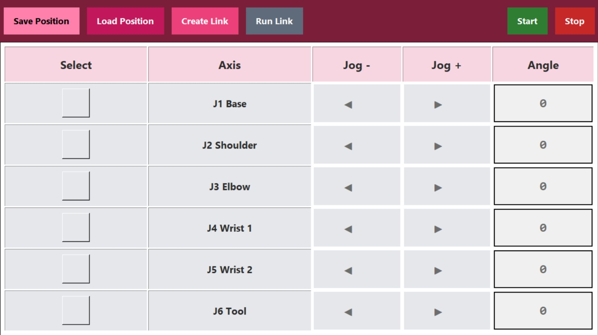

# CowBot – Robotic Control Unit

## Overview

CowBot is a robotic control unit developed as part of an engineering
internship project.

The system provides a Linux-based Human-Machine Interface (HMI)
for controlling and monitoring a 6-axis collaborative robot.

## System Architecture

The CowBot control unit is based on a layered architecture combining
a Linux-based Human-Machine Interface, an STM32 real-time gateway,
a PLC interface, and CAN communication with the 6-axis robotic system.

📄 **[View the complete CowBot System Architecture (PDF)](docs/cowbot-architecture.pdf)**

## Human-Machine Interface

The CowBot HMI was developed in Python using Tkinter and deployed
on an embedded Linux platform.

It provides an intuitive interface for controlling and supervising
the 6-axis robotic system.

### Main HMI Functions

- Manual control of the six robot joints
- Individual joint angle configuration
- Save and load robot positions
- Create and execute motion sequences
- Start and stop robot operations
- Robot state supervision
- UART/JSON communication with the STM32 controller

  

## Technologies

- STM32L431RCT6
- C / STM32 HAL
- CAN
- MCP2515
- UART / JSON
- Python / Tkinter
- Ubuntu Linux
- Git

## Main Features

- Manual control of the robot joints
- Robot state monitoring
- Position saving and loading
- Motion sequence creation
- UART communication between the Linux HMI and STM32
- CAN communication between the STM32 and the robot

## Repository Structure

- `firmware/` – STM32 firmware
- `hmi/` – Python/Tkinter Human-Machine Interface
- `docs/` – Architecture and technical documentation

## Author

**Chaimaa Harras**  
Electrical Engineering & Embedded Systems  
ENSA Khouribga
